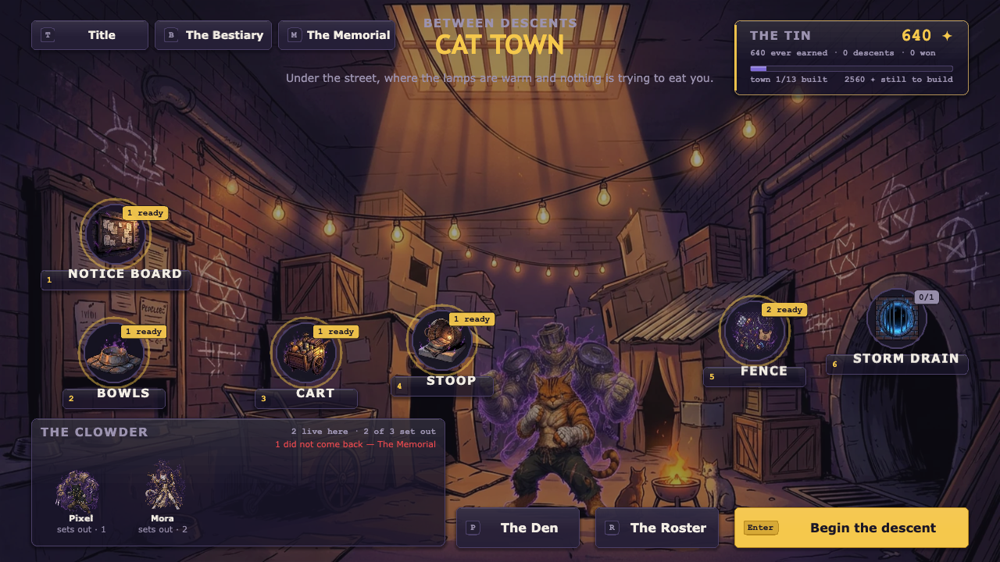
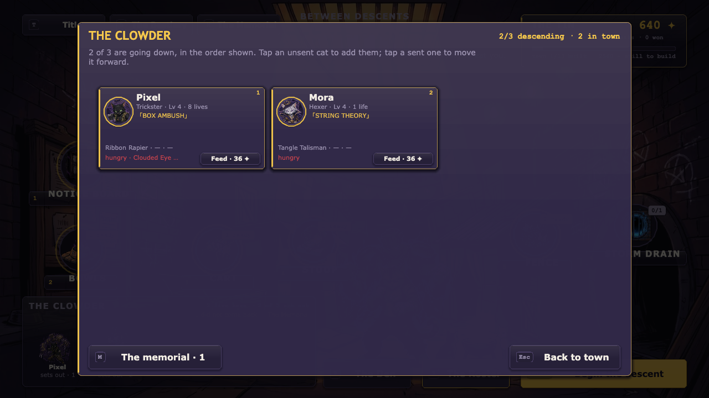
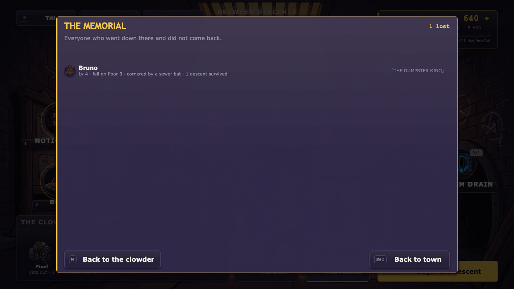
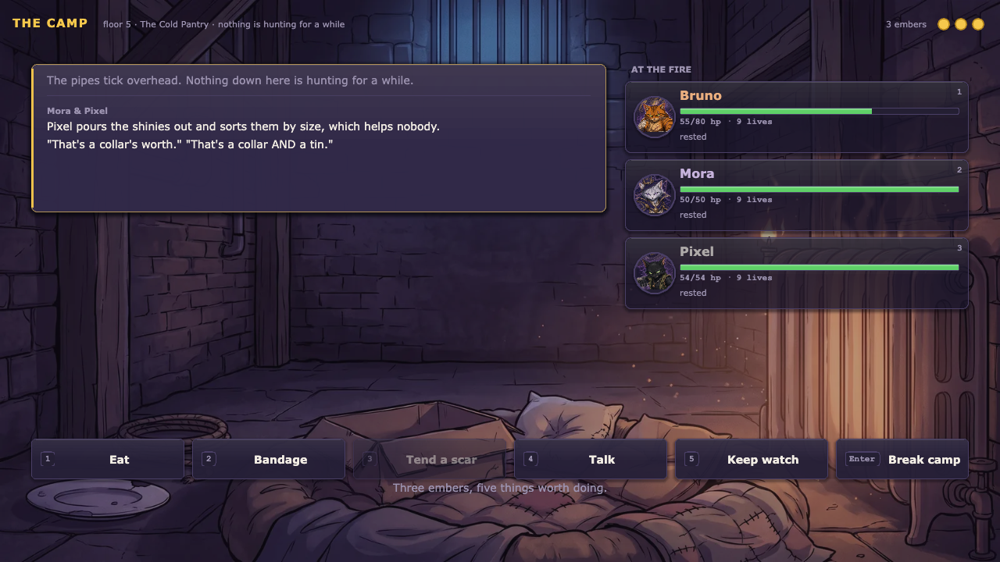
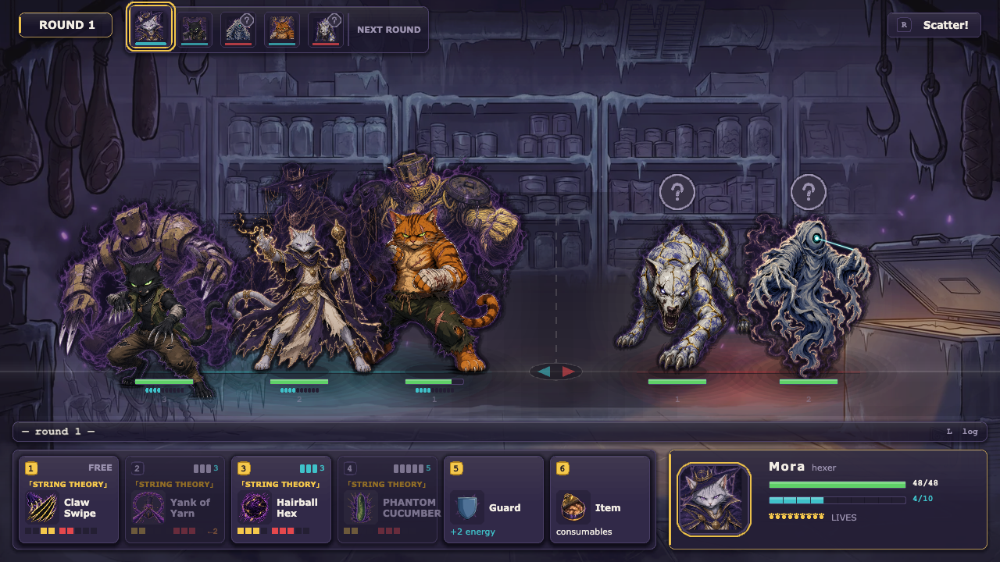
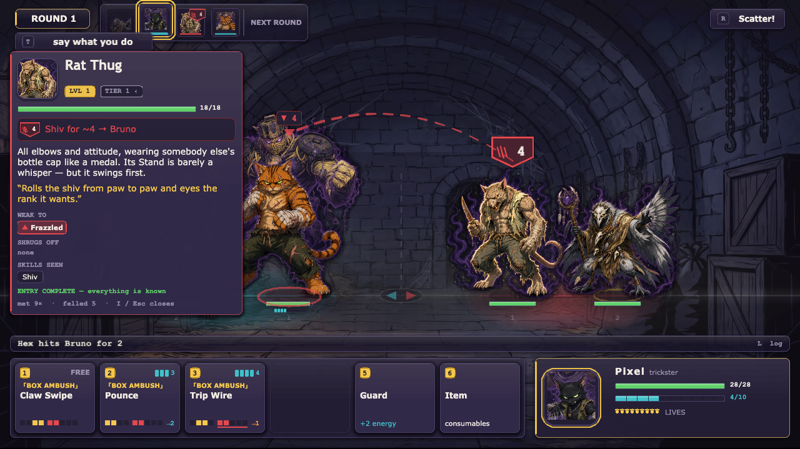
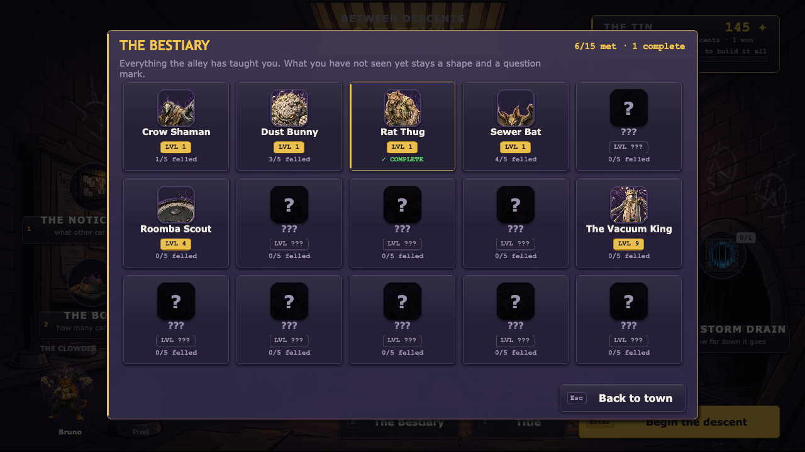
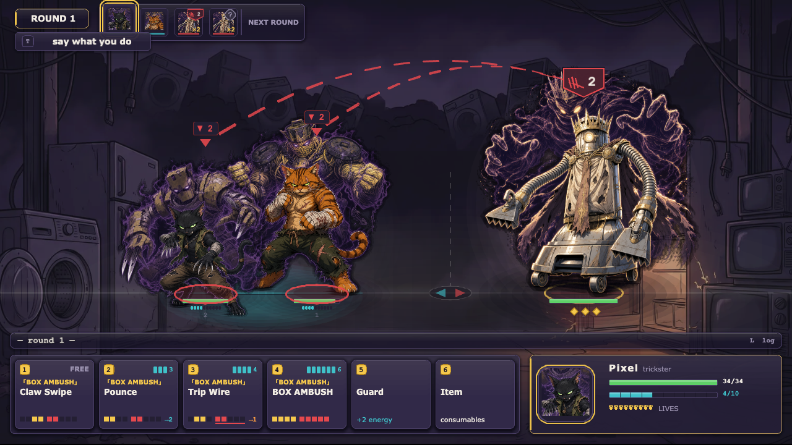
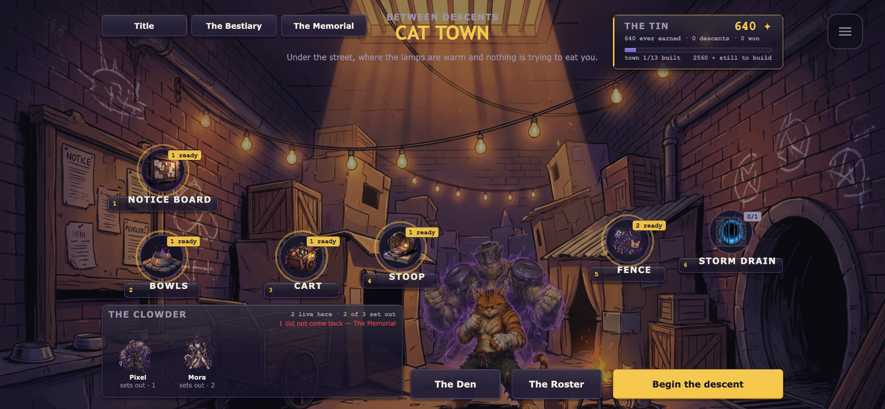
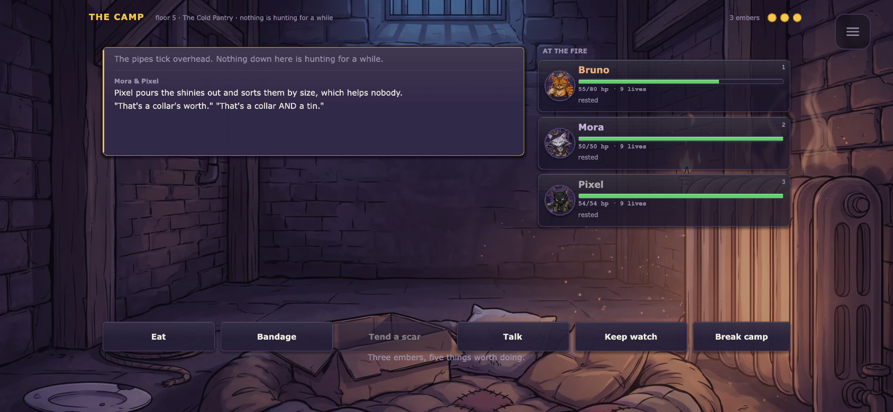

# c(at)rpg

*A cRPG of considerable fluffiness.* A clowder of stray cats descends through six
seeded dungeon floors, fights turn-based JRPG battles, hoards shinies, and makes
questionable dialog choices. A run **starts with two cats** and earns the rest: a
third can join mid-run, but only once **Cat Town** — the hub you come home to
between runs — houses somebody for it to be (Mora's Corner or Baguette's Basket),
and a fourth only once the town has bought the bowl as well. A brand-new town
therefore fields two. Each floor is a **run map** — a painted node
graph where picking the route *is* the gameplay — and at any encounter you can stop
pressing buttons and just **type what the party does**. Every cat — and every enemy —
is bound to a **Stand**: a spectral patron looming behind them that embodies their
power, announced in the battle log with all the drama it deserves («THE DUMPSTER
KING» descends!). Cats × bizarre-adventure shonen energy, built with
**PixiJS v8 + TypeScript**.


## Play

```bash
npm install
npm run dev     # http://localhost:8080 (next free port if it is taken)
```

Keyboard: **Enter** start / confirm · **S** enter a seed · **1–6** pick a place in
Cat Town · **1–3 / arrows** pick a route on the run map · **1–6** skills ·
**I** inspect an enemy · **T** say what you do · **R** flee · **P** The Den ·
**Esc** pause.

**On a phone it is all taps.** Every keyboard action has a real control, and
one rule covers the lot: **a tap acts, a long press reads.** Tapping a legal
target attacks it, a map medallion takes the route, a skill card picks it; a
400 ms hold opens the details instead — enemy intel, a cat's nameplate, a
route's blurb. Hit targets grow from the live letterbox scale so a 34 px route
chip answers to an 81 px box under a finger and still paints 34 px on a
monitor. Landscape only (portrait gets a rotate prompt), installable as a PWA,
and it runs offline after one visit. See `docs/design/mobile.md`.

## The game

- **The clowder** — Cat Town houses **individual cats**, not four class slots. A
  cat is an instance: a name, a class, a Stand, a level, its own gear, its own
  scars. A fresh town has **two** — Bruno and Pixel — and the clowder grows by
  unlocking, by recruiting, and by being *dreamed*. **The Roster** (`R` in town)
  is where you pick who descends and in what order; tap to send, tap again to
  move forward, shift-tap to bench. Levelling and gear happen in town, on cats
  you actually field.
- **Death is permanent** — Nine Lives is the *run*-scale buffer, and burning the
  last one is the end of that cat, from the profile, for good. **The Memorial**
  (`M`) keeps the name, the level, the floor they fell on and what did it. Their
  gear comes home to the town stash; the cat does not. A town can never be left
  empty — wipe the whole clowder and a free stray turns up at the gate.
- **The Camp** — a node on floors 4-6 where the party stops and the cats talk to
  *each other*. Three embers buy three of: eat, bandage, tend a scar, talk, keep
  watch. The exchange between two named cats is authored (41 of them, filtered
  by what is actually true at this fire) and the DM, when it is reachable,
  appends its own beat under it — so a slow or absent DM costs one paragraph and
  never a rule.
- **What a cat carries between runs** — **hunger** rises every descent and is
  bought off in town in shinies, so it competes with unlocks for the same tin;
  **scars** are permanent and only come from burning a Life; **quirks**, good and
  bad, are earned from what actually happened. All of it is on the roster card,
  because state you cannot see is state you cannot plan around.
- **The party** — Bruno the Bruiser and «THE DUMPSTER KING» (tank, shove offense),
  Pixel the Trickster and «BOX AMBUSH» (crit striker), Mora the Hexer and
  «STRING THEORY» (pulls, hexes, stuns), Baguette the Medic and «PURR ENGINE»
  (heals, revives). Shared party level 1–8, capstone Stand attacks at 4. You field
  **two** at the start, three by floor 3, four only with the Cat Town slot — and
  ranks, Cat Pile, rank-gated skills and the AI all work at every size (a skill's
  `usableFrom` is a *position in the line*, projected onto the bodies actually
  standing there, so a two-cat party never loses half its kit).
- **Combat — "Claws & Ranks"** — single-file ranks, up to 4 v 5. Any forced move can
  inflict **Off-Balance** (+30% damage taken), and damage resolves *before* movement,
  so shoves are a teammate-combo engine. It is a *combo*, not a tax: cheap shoves
  land it 60–75% of the time and only the expensive setup skills are guaranteed,
  tier-2/3 enemies shrug it off 25/40% of the time, and anything that just shook it
  off is **Braced** — immune for a full round, which kills perma-shove locks. Knock
  every enemy Off-Balance at once and the party unleashes a **Cat Pile** — a
  synchronized Stand barrage. Heavy bosses trade movement for a **Poise** meter —
  chip it to open them up. KO'd cats spend from a pool of **Nine Lives**.
- **Enemy intel — intents, inspection, the Bestiary** — combat tells you what is
  about to happen. Every living enemy telegraphs its next action above its head:
  a plate whose *silhouette* carries the meaning (a downward blade for a strike,
  a stretched wedge for a shove, a chip for a status, an upward point for a
  buff/heal, a diamond for a boss winding up), with the expected damage printed
  on it — so the HUD still reads in greyscale. Threat lines connect an intending
  enemy to the cat it named, and that cat carries the **total** it is about to
  take. This is an *engine* change, not a veneer: `startRound` publishes the
  declaration and the resolver is **bound** to it, so the telegraph cannot lie.
  It bends in exactly two ways, both your doing and both announced — kill or move
  the declared target and the same skill retargets; deny the skill's rank and the
  AI must pick again. Tap `I` to inspect: level, tier, description, its `tell`,
  and **what you know** — weaknesses, resistances and skills you have actually
  seen, everything else rendered `???` so the card doubles as a checklist.
  Knowledge is earned and persists: meeting a species opens its name and
  description *and* its telegraphs from the next fight on, watching a modifier
  fire reveals that tag, and five kills complete the entry forever. Cat Town
  hosts the **Bestiary** as a collection worth finishing. Weaknesses are
  mechanical, never decoration — a shove-weak enemy takes ×1.25 from any
  force-move hit, and a status it is weak to *always* lands while one it resists
  *never* does (neither rolls, because neither outcome was ever in doubt).
- **Cat Town** — the hub between runs. Shinies are banked **win or lose** (a failed
  run still pays), and spent at six places on a painted street: the bowls, the stoop,
  the fence, the cart, the notice board, the storm drain. Every unlock adds to the
  *pool of possibilities* rather than handing out flat power — a fourth party slot,
  new classes and Stands, starting gear, shop upgrades, later biomes, new encounter
  types. Unlock ids are `namespace:localId`, and any namespace the engine does not
  know becomes a content pool automatically, so a Stand or item the DM generated
  reaches a run without an engine change.
- **The run map** — each of the 6 floors is a small directed graph: entry on the
  left, boss or stairs on the right, 2–3 outgoing routes from wherever you stand.
  Nodes are `fight` / `elite` / `event` / `shop` / `rest` / `camp` / `treasure` /
  `boss`, each
  labelled before you walk into it, so a route is a legible gamble — the short path
  past two elites, or the long safe one with a Peddler. Branches you didn't take
  close visibly behind you; the regret is the point. Bosses on floors 3 and 6.
- **Say what you do** — at any encounter, a fight included, type an action instead of
  picking one. Out of combat: *"Bruno pries the grate open with the crowbar."* In
  combat: *"Pixel throws the lantern at the oil slick."* The DM answers in character
  and the **engine** applies whatever it authorised — recombinations of shipped
  effects only, budget-linted three times over, capped per floor. The DM is allowed
  to say no, and a refusal never costs you the turn.
- **Progression — "The Den"** — levelling is a set of decisions, not a stat bump.
  Every party level pays each cat one **whisker point** to spend from a six-line
  menu (HP/ATK/DEF/SPD/CRT/Energy, capped per stat so no line can be maxed cheaply);
  milestone levels teach each class new **Stand skills**, of which only **four** can
  be slotted at a time (slot 1 is always Claw Swipe), so learning a skill is a
  choice about what to bench; and a third equipment slot, the **collar**, sits
  beside the weapon and trinket with its own drop pool and Mewthical uniques.
  All of it lives on one screen — **THE DEN** (`P` from the Landing or the pause
  menu) — including a "where the numbers come from" table that breaks every stat
  into growth / points / gear / temporary buffs. Saves are versioned and migrated,
  so a run started before any of this still loads.
- **Loot** — class weapons, universal trinkets and collars in four rarities up to
  *Mewthical* (hand-authored uniques), consumables, and a Peddler both at the
  landing between floors and at any `shop` node on the map.
- **Events** — short scenarios with gated choices: risk a cat, spend shinies, or
  walk away. Rewards and punishments both delivered.
- **Deterministic** — one seeded RNG (fnv1a + mulberry32) with documented streams;
  the same seed is the same map *and* the same battles. Every roll a battle can draw
  is written down in one ordered table (`combat.md` §3.2), including the rule that
  keeps the new Off-Balance gates safe: *a gate is never drawn when the application
  could not have landed anyway* — a shove into a corpse, a re-shove of something
  already Off-Balance, and a push at a Braced target all cost zero entropy. The map
  is never saved — it regenerates from `(runSeed, floor)` — and traversal draws no
  randomness at all. Autosaves to localStorage; runs survive reloads, saves from two
  schema versions ago (back when this was a tile maze) still load, and a v1
  records-only Cat Town profile migrates forward into the town.
- **Tuned against a simulator, not vibes** — `npm run sim` is a headless harness that
  drives the *real* engine (`createBattle` / `startRound` / `resolveAction`, real
  content, real seeded RNG) with an AI on both sides, one trial per floor being a
  three-fight walk with HP persisting. It reports win/clear rate, rounds, Off-Balance
  uptime, Cat Piles per battle, Lives burned and damage share per cat. Every number
  in `docs/design/balance-and-meta.md` came out of it.

| | |
|---|---|
|  |  |
|  |  |
|  |  |
|  |  |
|  |  |
|  |  |

Every screen is built for a phone held sideways as well — same scenes, same taps,
844×390:

| | |
|---|---|
|  |  |

## Art & UI

Character art is **AI-generated anime cel-shading** (bold ink outlines, translucent
purple/gold Stands, flat `#1a1626` stage): battle sprites, HUD portraits, and the
title hero are produced with the Masonry CLI from a single approved style anchor
(`docs/art/style-anchor-bruno.png`) and shipped under `public/assets/gen/` with a
`manifest.json` (id → file/size). Alongside them sit **painted scene art** — one
backdrop per dungeon floor, per-event illustrations, the victory/defeat plates and
the Peddler — under `public/assets/gen/scenes/`. Battles are staged on the floor's
painting with parallax, contact shadows and a warm key light rather than on a flat
colour field.

The whole UI resolves through **one shared chrome kit** (`src/ui/widgets.ts`):
panels, avatars, bars, headings, buttons and backdrops, all built from the same
`PAL` / `TYPE` / `SPACE` / `RADIUS` tokens. No screen paints its own rectangle or
invents a font size, which is what keeps the title, the battle HUD, the Landing and
The Den looking like one game. Every asset-backed widget is painted-first with a
procedural fallback.

The loader is fail-soft — delete the manifest and the original procedural Graphics
renderers take over. **The game stays fully playable with zero generated assets**,
and that is verified as part of the release gate. Direction and asset contract:
`docs/design/visual-v2.md`. Visit `/?gallery=1` for the procedural fallback gallery.

**`npm run audit` keeps the art honest.** It cross-references all four manifests
against every reference in `src/` and `agent/` — literals *and* the template
prefixes most ids are actually built from (`` `scene:map:${n}` ``,
`` `equip:${id}` ``) — and reports dead ids, missing files, orphans, duplicates,
and anything stored past 3× the box it is drawn into. That last check quotes the
draw size from the call site and re-reads the constant out of the source, so it
fails if `CELL` or `R_BOSS` moves without the budget moving with it. Acting on
its first clean run took the art payload from **60.7 MB to 24.6 MB (−59.5%)**
with no visible change: `docs/art/ASSET-AUDIT.md`.

## The Dungeon Master (optional service)

The DM is a **Vercel [eve](https://vercel.com) agent with one durable session per
run** (`agent/`), so it remembers the whole adventure: that you bribed the rat king
on floor 2, that Baguette is out of Lives, that you promised the elder stray you'd
come back. `src/services/dm.ts` speaks its four HTTP routes directly — the agent SDK
and zod are deliberately never shipped to the browser.

- **Say what you do** — the `[T]` card in battle and in event modals. Out of combat
  the DM's verdict speaks the events vocabulary and is applied through the shipped
  `resolveOption`. In combat an `encounter` subagent adjudicates the line into an
  `EffectSpec` list + energy cost + target, and `resolveAction` runs it like any
  other action.
- **Party creator** — `[C] Create your party` on the title screen: describe one to
  four cats in free text and get back a full legal kit (classes, stats, skills,
  PowerScripts, Stand art prompts) that overlays the run's content tables.
- **Stand resonance discoveries** — every cat-power × enemy-power pairing is sent to
  the DM to compile into one extra bounded rule, or a definitive "these two ignore
  each other" (fire-and-forget, session-cached, so battle start never waits and a
  rule applies from the next fight featuring the pair); a discovered resonance
  attaches as an extra power script and announces itself once with a gold banner.
- **The Dreaming** — everything the DM authors that is worth keeping is validated,
  budget-linted, stamped with its style version and floor band, and written to a
  shared **Supabase** pool: items, events, enemies, encounters, Stands, cats,
  powers and floor backdrops, with their art re-hosted so the picture does not
  404 in a month. Later runs — and other players — draw from that pool first, and
  resonance verdicts (including the null ones) are memoised across everybody. The
  pool is an *enrichment layer*: with no database configured nothing is written,
  nothing is read, and the game plays exactly as it does now on authored content
  and the local profile.

**The DM authors content; it never computes outcomes.** Everything it emits is
recombination of shipped mechanics, and it is priced three separate times: by the
agent at authoring time, by the client on receipt, and by the engine at application
time — all three calling the *same* `powerBudget()` / `validatePowerScript()` the
Stand powers pass. A tampered response deals zero damage and degrades to pure
narration. A per-floor ramp caps one improvisation at `(2+floor)/8` of a full Stand
power. A refused, dropped or unaffordable verdict does not consume the turn.

Every adjudication is recorded on the run as `{prompt, verdict, effects, rngDraws}`,
and improvisation draws **no** RNG — so a transcript replays exactly and the model is
never re-consulted.

**The DM is optional and the game is offline-first — a hard rule, not a
nice-to-have.** With `VITE_DM_URL` unset (the default) the probe short-circuits
*without a request*, the typed-action affordance is never built, and every screen is
byte-identical to its no-DM behaviour. When a DM *is* configured, a probe that
merely **misses** — a cold TLS handshake, a sleeping function — no longer mutes it
for the whole session: the miss is retried on a later screen, at most three times
and never in a burst, because "slow" and "gone" look identical from the player's
side and only one of them should cost them the feature. The party creator falls back to a "using the
Strays" toast, event modals render without the extra row, and battles run with stock
powers. This is verified in the release gate by playing a run with the DM pointed at
a dead host. There is no fallback service behind it: the six stateless
`api/gm/*` functions the DM replaced are deleted, and the game's Vercel project
ships no serverless functions at all.

Design: `docs/design/run-map-and-dm.md` §§3–4 · deploy & operations:
`docs/DM-DEPLOY.md`.

## Development

```bash
npm test            # vitest — engine + content + integration + DM suites
npm run typecheck   # tsc --noEmit (strict; src only)
npm run lint        # eslint, incl. layering rule: src/core imports no pixi
npm run build       # production build
npm run sim         # headless balance harness (see --floors/--trials/--party/--roster)
npm run audit       # generated-art audit: dead ids, orphans, oversized art (exit 1 on findings)
npm run audit:fix   # resample whatever the audit calls oversized, rewrite the manifests
npm run typecheck:agent        # typecheck the DM agent (src/ is pulled in transitively)
npx eve info                   # compile-check the agent (tools, skills, subagents)
```

**The release gate is a browser playing the game, not a test suite.** Under
`tests/browser/` are Playwright harnesses that drive the real bundle in headless
chromium and read the live scene through DEV-only hooks (`__scene`, `__run`,
`__battle`, `__ui`, `__units`, `__hits`, `__text`) rather than guessing from
pixels — so "the run got stuck" fails the gate instead of being absorbed by a
rotation of hopeful keypresses.

```bash
npx tsx tests/browser/full-run.ts      # floors 5→6→the Dogfather→victory→Cat Town,
                                       # then a wipe; both to the results screen
npx tsx tests/browser/final-gate.ts    # desktop + phone sweep, every screen
npx tsx tests/browser/boss-playtest.ts # the lair on its own
```

Anything that must exercise the **live** DM has to be served on **port 8080** —
that origin is on the deployed agent's CORS allow-list and the playtest port is
not (`docs/DM-DEPLOY.md`).

The codebase is strictly layered (see `docs/ARCHITECTURE.md`):

| Layer | What lives there |
|---|---|
| `src/core` | Pure deterministic engines: combat, run-map generation and traversal, loot, events, run state, and the Cat Town meta layer (`core/meta`: payout, profile, unlock catalog, run overlay). No pixi, no `Math.random`. |
| `src/content` | Data-only tables: classes, skills, enemies, bosses, items, events, floors. |
| `src/ui` | PixiJS scenes and widgets. Renders engine event logs; computes no outcomes. |
| `src/services` | The DM client, the one-shot pipelines, and the pure rules the browser and the agent share: the cap tables, the content lints and the Power Script budget lint. No pixi, no `Math.random`. |
| `agent` | The persistent DM (Vercel eve): tools, skills, the encounter subagent. Never bundled into the browser. |

Design docs: `docs/GDD.md` (canonical rulings), `docs/design/*.md` (per-system specs
with worked examples that double as test fixtures). `docs/design/dungeon.md` is
**superseded** — it described the tile maze this replaced, and survives only for its
RNG scheme, per-floor knobs and pack-building algorithm, which are still canonical.

---

Designed and implemented by a multi-agent Claude workflow (Claude Code).
