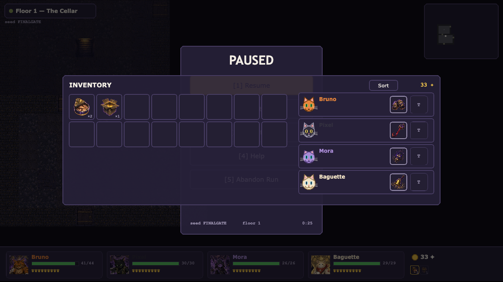

# c(at)rpg

*A cRPG of considerable fluffiness.* Four stray cats descend through a procedurally
generated dungeon, fight turn-based JRPG battles, hoard shinies, and make questionable
dialog choices. Every cat — and every enemy — is bound to a **Stand**: a spectral
patron looming behind them that embodies their power, announced in the battle log
with all the drama it deserves («THE DUMPSTER KING» descends!). Cats × bizarre-adventure
shonen energy, built with **PixiJS v8 + TypeScript**.


## Play

```bash
npm install
npm run dev     # http://localhost:5173
```

Keyboard: **Enter** start · **S** enter a seed · **arrows/WASD** move · **1–6** skills ·
**R** flee · **Tab** marching order · **M** map · **Esc** pause.

## The game

- **The party** — Bruno the Bruiser and «THE DUMPSTER KING» (tank, shove offense),
  Pixel the Trickster and «BOX AMBUSH» (crit striker), Mora the Hexer and
  «STRING THEORY» (pulls, hexes, stuns), Baguette the Medic and «PURR ENGINE»
  (heals, revives). Shared party level 1–8, capstone Stand attacks at 4.
- **Combat — "Claws & Ranks"** — 4v5 single-file ranks. Any forced move inflicts
  **Off-Balance** (+50% damage taken), and damage resolves *before* movement, so
  shoves are a teammate-combo engine. Knock every enemy Off-Balance at once and the
  party unleashes a **Cat Pile** — a synchronized Stand barrage. Heavy bosses trade
  movement for a **Poise** meter — chip it to open them up. KO'd cats spend from a
  pool of **Nine Lives**.
- **Dungeon** — 6 seeded floors of rooms-in-a-maze (Nystrom), fog of war, visible
  patrolling enemies, chests, narrative event tiles; bosses on floors 3 and 6.
- **Loot** — class weapons + universal trinkets in four rarities up to *Mewthical*
  (hand-authored uniques), consumables, and a Peddler at the landing between floors.
- **Events** — short scenarios with gated choices: risk a cat, spend shinies, or
  walk away. Rewards and punishments both delivered.
- **Deterministic** — one seeded RNG (fnv1a + mulberry32) with documented streams;
  the same seed is the same run. Autosaves to localStorage; runs survive reloads.

| | |
|---|---|
|  |  |
|  |  |

## Art pipeline

Character art is **AI-generated anime cel-shading** (bold ink outlines, translucent
purple/gold Stands, flat `#1a1626` stage): battle sprites, HUD portraits, and the
title hero are produced with the Masonry CLI from a single approved style anchor
(`docs/art/style-anchor-bruno.png`) and shipped under `public/assets/gen/` with a
`manifest.json` (id → file/size). The loader is fail-soft — delete the manifest and
the original procedural Graphics renderers take over; the game must stay fully
playable with zero generated assets. Direction and asset contract:
`docs/design/visual-v2.md`. Visit `/?gallery=1` for the procedural fallback gallery.

## AI Game Master (optional service)

An optional serverless GM authors content on the fly — free-text party generation
("a paranoid sphynx who controls static electricity" → a legal 4-cat kit with
Stands), fresh events, items, and bounded run steering — via Vercel functions under
`api/gm/*` using the official `@anthropic-ai/sdk` with structured outputs. Every
generation passes the same validators the shipped static content passes, and lands
in a shared content pool that grows as people play.

Three GM features are now wired client-side (`src/services/gm.ts` is the typed
client):

- **Party creator** — `[C] Create your party` on the title screen: describe one to
  four cats in free text and the GM returns a full legal kit (classes, stats,
  skills, PowerScripts, Stand art prompts) that overlays the run's content tables.
- **Free-text event actions** — when the GM is reachable, event modals gain a
  `[T] Do something else…` option: type anything and the GM maps it onto the same
  bounded, validated effect set the authored options use.
- **Stand resonance discoveries** — cat-power × enemy-power pairings are checked
  against GM-authored interaction rules (session-cached, prefetched in the
  background); a discovered resonance attaches an extra bounded power script and
  announces itself once with a gold banner.

**The GM is optional and the game is offline-first.** With no deployed service
(the default) every feature above silently degrades to the exact static behavior:
the party creator shows a "GM offline — using the Strays" toast and starts a
normal default-party run, event modals render without the free-text option, and
battles run with stock powers only. No feature ever blocks on the network.
Design: `docs/design/gm-system.md` · deploy & operations: `docs/GM-DEPLOY.md`.

## Development

```bash
npm test            # vitest — engine + content + integration + GM suites
npm run typecheck   # tsc --noEmit (strict; src only)
npm run lint        # eslint, incl. layering rule: src/core imports no pixi
npm run build       # production build
npx tsc -p api/tsconfig.json   # typecheck the GM serverless functions
```

The codebase is strictly layered (see `docs/ARCHITECTURE.md`):

| Layer | What lives there |
|---|---|
| `src/core` | Pure deterministic engines: combat, dungeon gen, loot, events, run state. No pixi, no `Math.random`. |
| `src/content` | Data-only tables: classes, skills, enemies, bosses, items, events, floors. |
| `src/ui` | PixiJS scenes and widgets. Renders engine event logs; computes no outcomes. |
| `api` | GM serverless functions (types-and-validators-only imports from `src`). |

Design docs: `docs/GDD.md` (canonical rulings), `docs/design/*.md` (per-system specs
with worked examples that double as test fixtures).

---

Designed and implemented by a multi-agent Claude workflow (Claude Code).
