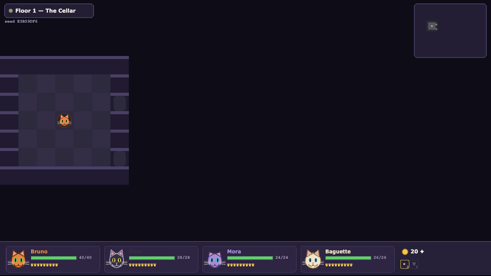

# c(at)rpg

*A cRPG of considerable fluffiness.* Four stray cats descend through a procedurally
generated dungeon, fight turn-based JRPG battles, hoard shinies, and make questionable
dialog choices. Built with **PixiJS v8 + TypeScript** — every pixel drawn procedurally,
zero art assets.


## Play

```bash
npm install
npm run dev     # http://localhost:5173
```

Keyboard: **Enter** start · **S** enter a seed · **arrows/WASD** move · **1–6** skills ·
**R** flee · **Tab** marching order · **M** map · **Esc** pause.

## The game

- **The party** — Bruno the Bruiser (tank, shove offense), Pixel the Trickster
  (crit striker), Mora the Hexer (pulls, hexes, stuns), Baguette the Medic
  (heals, revives). Shared party level 1–8, capstone skills at 4.
- **Combat — "Claws & Ranks"** — 4v5 single-file ranks. Any forced move inflicts
  **Off-Balance** (+50% damage taken), and damage resolves *before* movement, so
  shoves are a teammate-combo engine. Knock every enemy Off-Balance at once and the
  party unleashes a **Cat Pile**. Heavy bosses trade movement for a **Poise** meter —
  chip it to open them up. KO'd cats spend from a pool of **Nine Lives**.
- **Dungeon** — 6 seeded floors of rooms-in-a-maze (Nystrom), fog of war, visible
  patrolling enemies, chests, narrative event tiles; bosses on floors 3 and 6.
- **Loot** — class weapons + universal trinkets in four rarities up to *Mewthical*
  (hand-authored uniques), consumables, and a Peddler at the landing between floors.
- **Events** — short scenarios with gated choices: risk a cat, spend shinies, or
  walk away. Rewards and punishments both delivered.
- **Deterministic** — one seeded RNG (fnv1a + mulberry32) with documented streams;
  the same seed is the same run. Autosaves to localStorage; runs survive reloads.




## Development

```bash
npm test            # vitest — engine + content + integration suites
npm run typecheck   # tsc --noEmit (strict)
npm run lint        # eslint, incl. layering rule: src/core imports no pixi
npm run build       # production build
```

The codebase is strictly layered (see `docs/ARCHITECTURE.md`):

| Layer | What lives there |
|---|---|
| `src/core` | Pure deterministic engines: combat, dungeon gen, loot, events, run state. No pixi, no `Math.random`. |
| `src/content` | Data-only tables: classes, skills, enemies, bosses, items, events, floors. |
| `src/ui` | PixiJS scenes and widgets. Renders engine event logs; computes no outcomes. |

Design docs: `docs/GDD.md` (canonical rulings), `docs/design/*.md` (per-system specs
with worked examples that double as test fixtures). Visit `/?gallery=1` for the
procedural cat & enemy sprite gallery.

---

Designed and implemented by a multi-agent Claude workflow (Claude Code).
