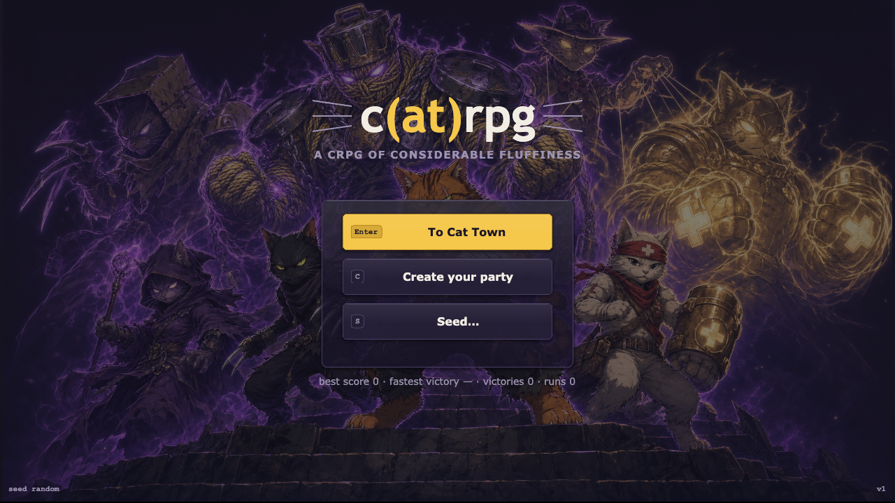
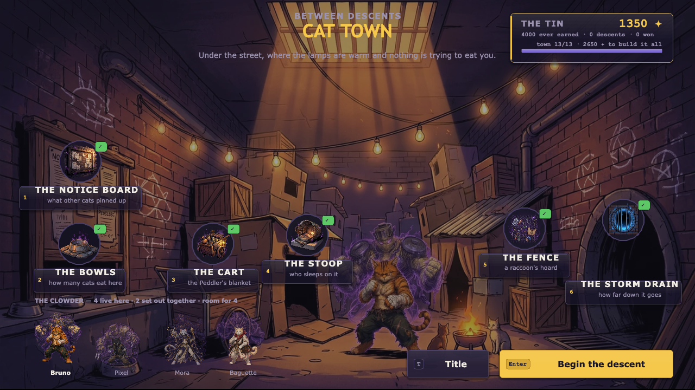
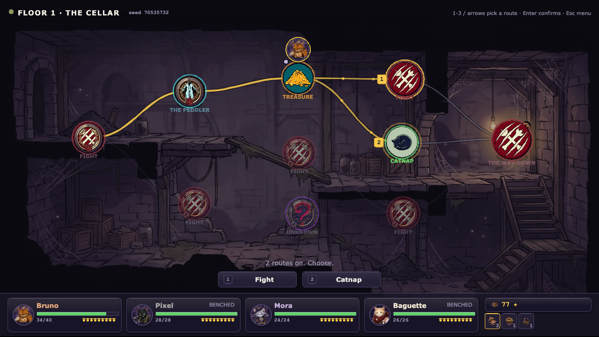
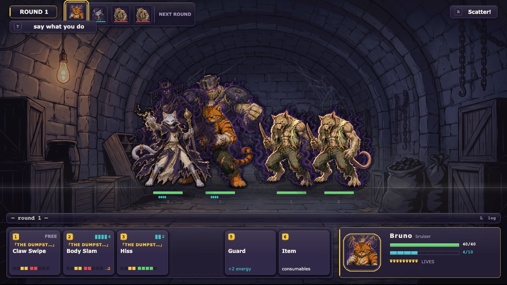
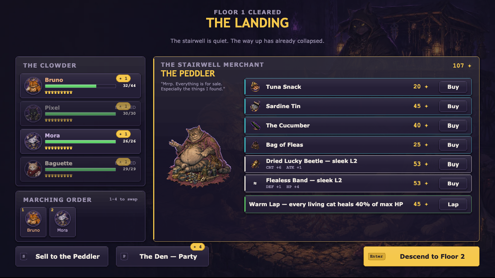
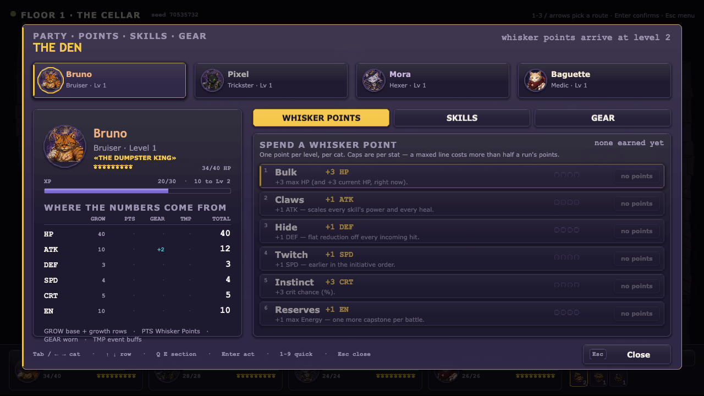
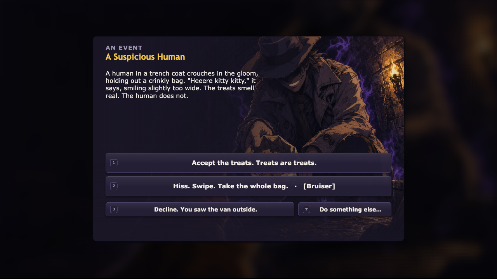
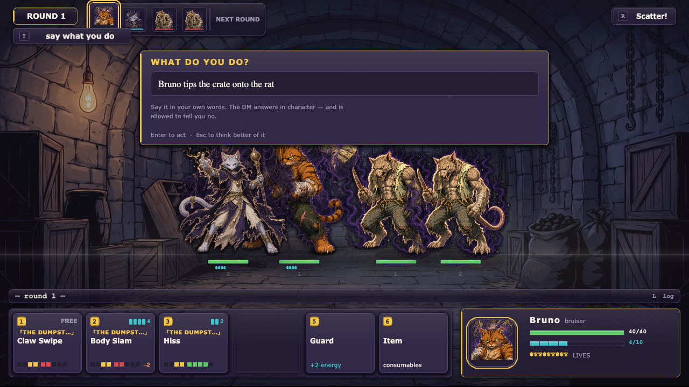
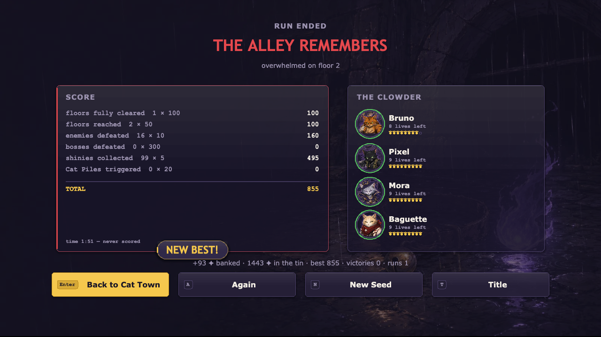

# c(at)rpg

*A cRPG of considerable fluffiness.* A clowder of stray cats descends through six
seeded dungeon floors, fights turn-based JRPG battles, hoards shinies, and makes
questionable dialog choices. A run **starts with two cats** and earns the rest: a
third joins mid-run, a fourth only once **Cat Town** — the hub you come home to
between runs — has bought the bowl. Each floor is a **run map** — a painted node
graph where picking the route *is* the gameplay — and at any encounter you can stop
pressing buttons and just **type what the party does**. Every cat — and every enemy —
is bound to a **Stand**: a spectral patron looming behind them that embodies their
power, announced in the battle log with all the drama it deserves («THE DUMPSTER
KING» descends!). Cats × bizarre-adventure shonen energy, built with
**PixiJS v8 + TypeScript**.



## Play

```bash
npm install
npm run dev     # http://localhost:8080 (next free port if it is taken)
```

Keyboard: **Enter** start / confirm · **S** enter a seed · **1–6** pick a place in
Cat Town · **1–3 / arrows** pick a route on the run map · **1–6** skills ·
**T** say what you do · **R** flee · **P** The Den · **Esc** pause.

## The game

- **The party** — Bruno the Bruiser and «THE DUMPSTER KING» (tank, shove offense),
  Pixel the Trickster and «BOX AMBUSH» (crit striker), Mora the Hexer and
  «STRING THEORY» (pulls, hexes, stuns), Baguette the Medic and «PURR ENGINE»
  (heals, revives). Shared party level 1–8, capstone Stand attacks at 4. You field
  **two** at the start, three by floor 3, four only with the Cat Town slot — and
  ranks, Cat Pile, rank-gated skills and the AI all work at every size (a skill's
  `usableFrom` is a *position in the line*, projected onto the bodies actually
  standing there, so a two-cat party never loses half its kit).
- **Combat — "Claws & Ranks"** — single-file ranks, up to 4 v 5. Any forced move can
  inflict **Off-Balance** (+30% damage taken), and damage resolves *before* movement,
  so shoves are a teammate-combo engine. It is a *combo*, not a tax: cheap shoves
  land it 60–75% of the time and only the expensive setup skills are guaranteed,
  tier-2/3 enemies shrug it off 25/40% of the time, and anything that just shook it
  off is **Braced** — immune for a full round, which kills perma-shove locks. Knock
  every enemy Off-Balance at once and the party unleashes a **Cat Pile** — a
  synchronized Stand barrage. Heavy bosses trade movement for a **Poise** meter —
  chip it to open them up. KO'd cats spend from a pool of **Nine Lives**.
- **Cat Town** — the hub between runs. Shinies are banked **win or lose** (a failed
  run still pays), and spent at six places on a painted street: the bowls, the stoop,
  the fence, the cart, the notice board, the storm drain. Every unlock adds to the
  *pool of possibilities* rather than handing out flat power — a fourth party slot,
  new classes and Stands, starting gear, shop upgrades, later biomes, new encounter
  types. Unlock ids are `namespace:localId`, and any namespace the engine does not
  know becomes a content pool automatically, so a Stand or item the DM generated
  reaches a run without an engine change.
- **The run map** — each of the 6 floors is a small directed graph: entry on the
  left, boss or stairs on the right, 2–3 outgoing routes from wherever you stand.
  Nodes are `fight` / `elite` / `event` / `shop` / `rest` / `treasure` / `boss`, each
  labelled before you walk into it, so a route is a legible gamble — the short path
  past two elites, or the long safe one with a Peddler. Branches you didn't take
  close visibly behind you; the regret is the point. Bosses on floors 3 and 6.
- **Say what you do** — at any encounter, a fight included, type an action instead of
  picking one. Out of combat: *"Bruno pries the grate open with the crowbar."* In
  combat: *"Pixel throws the lantern at the oil slick."* The DM answers in character
  and the **engine** applies whatever it authorised — recombinations of shipped
  effects only, budget-linted three times over, capped per floor. The DM is allowed
  to say no, and a refusal never costs you the turn.
- **Progression — "The Den"** — levelling is a set of decisions, not a stat bump.
  Every party level pays each cat one **whisker point** to spend from a six-line
  menu (HP/ATK/DEF/SPD/CRT/Energy, capped per stat so no line can be maxed cheaply);
  milestone levels teach each class new **Stand skills**, of which only **four** can
  be slotted at a time (slot 1 is always Claw Swipe), so learning a skill is a
  choice about what to bench; and a third equipment slot, the **collar**, sits
  beside the weapon and trinket with its own drop pool and Mewthical uniques.
  All of it lives on one screen — **THE DEN** (`P` from the Landing or the pause
  menu) — including a "where the numbers come from" table that breaks every stat
  into growth / points / gear / temporary buffs. Saves are versioned and migrated,
  so a run started before any of this still loads.
- **Loot** — class weapons, universal trinkets and collars in four rarities up to
  *Mewthical* (hand-authored uniques), consumables, and a Peddler both at the
  landing between floors and at any `shop` node on the map.
- **Events** — short scenarios with gated choices: risk a cat, spend shinies, or
  walk away. Rewards and punishments both delivered.
- **Deterministic** — one seeded RNG (fnv1a + mulberry32) with documented streams;
  the same seed is the same map *and* the same battles. Every roll a battle can draw
  is written down in one ordered table (`combat.md` §3.2), including the rule that
  keeps the new Off-Balance gates safe: *a gate is never drawn when the application
  could not have landed anyway* — a shove into a corpse, a re-shove of something
  already Off-Balance, and a push at a Braced target all cost zero entropy. The map
  is never saved — it regenerates from `(runSeed, floor)` — and traversal draws no
  randomness at all. Autosaves to localStorage; runs survive reloads, saves from two
  schema versions ago (back when this was a tile maze) still load, and a v1
  records-only Cat Town profile migrates forward into the town.
- **Tuned against a simulator, not vibes** — `npm run sim` is a headless harness that
  drives the *real* engine (`createBattle` / `startRound` / `resolveAction`, real
  content, real seeded RNG) with an AI on both sides, one trial per floor being a
  three-fight walk with HP persisting. It reports win/clear rate, rounds, Off-Balance
  uptime, Cat Piles per battle, Lives burned and damage share per cat. Every number
  in `docs/design/balance-and-meta.md` came out of it.

| | |
|---|---|
|  |  |
|  |  |
|  |  |
|  |  |

## Art & UI

Character art is **AI-generated anime cel-shading** (bold ink outlines, translucent
purple/gold Stands, flat `#1a1626` stage): battle sprites, HUD portraits, and the
title hero are produced with the Masonry CLI from a single approved style anchor
(`docs/art/style-anchor-bruno.png`) and shipped under `public/assets/gen/` with a
`manifest.json` (id → file/size). Alongside them sit **painted scene art** — one
backdrop per dungeon floor, per-event illustrations, the victory/defeat plates and
the Peddler — under `public/assets/gen/scenes/`. Battles are staged on the floor's
painting with parallax, contact shadows and a warm key light rather than on a flat
colour field.

The whole UI resolves through **one shared chrome kit** (`src/ui/widgets.ts`):
panels, avatars, bars, headings, buttons and backdrops, all built from the same
`PAL` / `TYPE` / `SPACE` / `RADIUS` tokens. No screen paints its own rectangle or
invents a font size, which is what keeps the title, the battle HUD, the Landing and
The Den looking like one game. Every asset-backed widget is painted-first with a
procedural fallback.

The loader is fail-soft — delete the manifest and the original procedural Graphics
renderers take over. **The game stays fully playable with zero generated assets**,
and that is verified as part of the release gate. Direction and asset contract:
`docs/design/visual-v2.md`. Visit `/?gallery=1` for the procedural fallback gallery.

## The Dungeon Master (optional service)

The DM is a **Vercel [eve](https://vercel.com) agent with one durable session per
run** (`agent/`), so it remembers the whole adventure: that you bribed the rat king
on floor 2, that Baguette is out of Lives, that you promised the elder stray you'd
come back. `src/services/dm.ts` speaks its four HTTP routes directly — the agent SDK
and zod are deliberately never shipped to the browser.

- **Say what you do** — the `[T]` card in battle and in event modals. Out of combat
  the DM's verdict speaks the events vocabulary and is applied through the shipped
  `resolveOption`. In combat an `encounter` subagent adjudicates the line into an
  `EffectSpec` list + energy cost + target, and `resolveAction` runs it like any
  other action.
- **Party creator** — `[C] Create your party` on the title screen: describe one to
  four cats in free text and get back a full legal kit (classes, stats, skills,
  PowerScripts, Stand art prompts) that overlays the run's content tables.
- **Stand resonance discoveries** — cat-power × enemy-power pairings are checked
  against authored interaction rules (session-cached, prefetched in the background);
  a discovered resonance attaches an extra bounded power script and announces itself
  once with a gold banner.

**The DM authors content; it never computes outcomes.** Everything it emits is
recombination of shipped mechanics, and it is priced three separate times: by the
agent at authoring time, by the client on receipt, and by the engine at application
time — all three calling the *same* `powerBudget()` / `validatePowerScript()` the
Stand powers pass. A tampered response deals zero damage and degrades to pure
narration. A per-floor ramp caps one improvisation at `(2+floor)/8` of a full Stand
power. A refused, dropped or unaffordable verdict does not consume the turn.

Every adjudication is recorded on the run as `{prompt, verdict, effects, rngDraws}`,
and improvisation draws **no** RNG — so a transcript replays exactly and the model is
never re-consulted.

**The DM is optional and the game is offline-first — a hard rule, not a
nice-to-have.** With `VITE_DM_URL` unset (the default) the probe short-circuits
*without a request*, the typed-action affordance is never built, and every screen is
byte-identical to its no-DM behaviour. The party creator falls back to a "using the
Strays" toast, event modals render without the extra row, and battles run with stock
powers. This is verified in the release gate by playing a run with the DM pointed at
a dead host. The older stateless endpoints under `api/gm/*` remain as a fallback
until the agent reaches full parity.

Design: `docs/design/run-map-and-dm.md` §§3–4 · deploy & operations:
`docs/DM-DEPLOY.md` (agent) and `docs/GM-DEPLOY.md` (legacy endpoints).

## Development

```bash
npm test            # vitest — engine + content + integration + GM suites
npm run typecheck   # tsc --noEmit (strict; src only)
npm run lint        # eslint, incl. layering rule: src/core imports no pixi
npm run build       # production build
npm run sim         # headless balance harness (see --floors/--trials/--party/--roster)
npx tsc -p api/tsconfig.json   # typecheck the GM serverless functions
npm run typecheck:agent        # typecheck the DM agent
npx eve info                   # compile-check the agent (tools, skills, subagents)
```

The codebase is strictly layered (see `docs/ARCHITECTURE.md`):

| Layer | What lives there |
|---|---|
| `src/core` | Pure deterministic engines: combat, run-map generation and traversal, loot, events, run state, and the Cat Town meta layer (`core/meta`: payout, profile, unlock catalog, run overlay). No pixi, no `Math.random`. |
| `src/content` | Data-only tables: classes, skills, enemies, bosses, items, events, floors. |
| `src/ui` | PixiJS scenes and widgets. Renders engine event logs; computes no outcomes. |
| `src/services` | Network clients (GM, DM) and the pure verdict-lint half. No pixi. |
| `agent` | The persistent DM (Vercel eve): tools, skills, the encounter subagent. Never bundled into the browser. |
| `api` | Legacy GM serverless functions (types-and-validators-only imports from `src`). |

Design docs: `docs/GDD.md` (canonical rulings), `docs/design/*.md` (per-system specs
with worked examples that double as test fixtures). `docs/design/dungeon.md` is
**superseded** — it described the tile maze this replaced, and survives only for its
RNG scheme, per-floor knobs and pack-building algorithm, which are still canonical.

---

Designed and implemented by a multi-agent Claude workflow (Claude Code).
